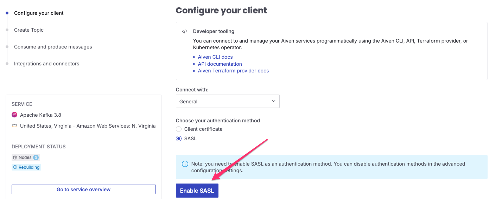

# Building IoT Solution For Farm Monitoring using Aiven Services

In farming there are at least two types of data points that are critical to growth and health of crops - atmospheric and soil conditions. 
Humidity, temperature and soil moisture levels needs to be monitored to determine if crops needs more water or not. This project provides 
the code to generate sample IoT sensor data that represents atmospheric and soil conditions. See the sample dataset below in JSON.

```json
{
    "deviceId": "42dbc2e7-f3bc-4edf-8e39-6504da1dc792",
    "temperature": 98.16,
    "humidity": 64.71,
    "soilType": "SANDY",
    "moisture_level": 12.74,
    "add_water": "false",
    "recordDate": "2024-12-06 01:38:01"
}
```
It's a simple set of data but enough to provide an idea when crops needs to be watered or not. The add_water field is automatically calculated
based on some thresholds. For instance, water is needed when temperature is less than 64°F along with the set of soil moisture conditions below.

Table.1 Soil Moisture Level
| Soil Type  |  High  | Medium  | Low  |
| ---------  | :-----:| :------:| ---: |
| Clay       | 80-100 | 60-80   | <60  |
| Loamy      | 88-100 | 70-88   | <70  |
| Sandy      | 90-100 | 80-90   | <80  |  

The following tutorial shows you how to ingest the IoT data into Aiven, the unified platform to stream, store and serve data on any cloud.
You are free to use upto $300 of credits which is more than enough to test out the exercise below. 

Here's the use case that we will solve. 

1. Emit IoT event into Aiven for Apache Kafka
2. Integrate Aiven for Apache Flink & build a Flink application that filters the event using the addWater boolean attribute. Since addWater is a boolean attribute, this implies we need two new Kafka topics to store the respective events
3. Integrate Aiven for Kafka -> Aiven for Metrics -> Aiven for Grafana to gather metrics from Kafka service

This will be a complete solution to push the events into Kafka with monitoring in realtime. 

### Emit IoT event into Aiven for Apache Kafka
#### Prerequisites
You should have created your Aiven account [here](https://console.aiven.io/signup). Take note of the following information. For authentication, in this tutorial, we will use SASL.
* SASL Username
* SASL Password
* TRUSTSTORE Password
* TRUSTSTORE Location
* Bootstrap Servers

1. After creating your account, go to your Aiven console and click **Create Service** 
2. Choose **Apache Kafka** 
3. Fill in the form. You can leave everything the same except for the service plan. Choose **Startup** for the service plan as it will not eat up your credits faster. Then name snd create your service. 
4. You will be taken to the **Services** page with your Kafka service being built. You should see something similar below 
5. This will take you to the **Configure your client** page . Click **Enable SASL**.
6. Aiven will generate the details for ther service URL and other important details 

   Create and name your **topic** and finish setup. Use the **farm_sensor** topic name.

Go to the com.aiven.kafka.Producer and update the missing values for the properties mentioned above. Once you have them all populated, execute this code. 
Messages are created every second and pushed to the Kafka topic created earlier. Go to **Topics**.  

Make sure you have 3 topics configured.
* farm_sensor - topic that stores raw events
* dry_soil - topic that stores transformed events that indicates crops need water
* wet_soil - topic that stores transformed events that indicates crops doesn't need water

**farm_sensor** topic should have events by now. Click on **Topic message** . 
Change the **FORMAT** filter to json and click on **Fetch messages**. You should see events. 

This complete the Kafka setup.

### Integrate Aiven for Apache Flink
Flink will be used to transform the events from farm_sensor topic then route them based on the value of **add_water** field which is a boolean. At this point, you should be familiar in creating services in Aiven. 
1. Create Apache Flink service. Choose the same cloud, region as your Kafka service. Name your service.
2. Once its created, click on Applications on the left panel then click **Create Application** . 
3. Click on **Create first version** 
4. Before you add your source table, make sure that you have integrated Kafka with your Flink service. Click on **Manage integrations** and choose your kafka service and click **Integrate**  Add your source table 
5. Choose your Kafka service and enter the SQL create statement . For this table, use the [create-table-for-dry-soil.sql](aiven/flink/create-table-for-farm-sensor.sql) script. Click **Add Tabke**.
6. Click **Next** to create Sink tables .
7. Click **Add your first sink table** .
8. Choose your Kafka service and copy/paste the sql statement from [create-table-for-dry-soil.sql](aiven/flink/create-table-for-dry-soil.sql) script. Add new table.
9. Add one more sink table using [create-table-for-wet-soil](aiven/flink/create-table-for-wet-soil.sql)
10. You should see two sink tables named dry_soil & wet_soil  Click **Next**.
11. This is where you can do your transformation/filtering of events from **farm_sensor** topic. Copy/paste the statement from [farm_sensor_transform.sql](aiven/flink/farm_sensor_transform.sql) and add it to the create statement page. It does two things - transform **recordDate** field into a TIMESTAMP format so Flink can deserialize this column and filter the events based on add_water value. Click **Save and deploy later**.
12. Your Flink job is not deployed yet. You will see something similar below. It shows the data pipeline created earlier. To deploy your pipeline, click **Create deployment** 

Once your pipeline is running, you should be able to see events in dry_soil and wet_soil topics. 
